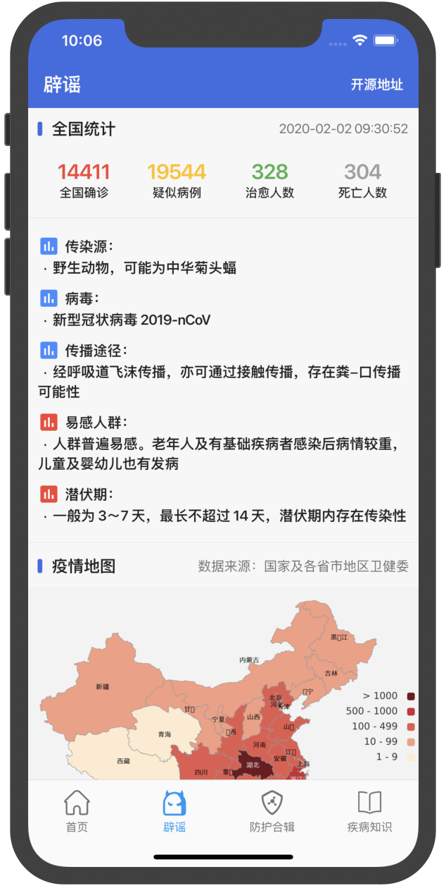
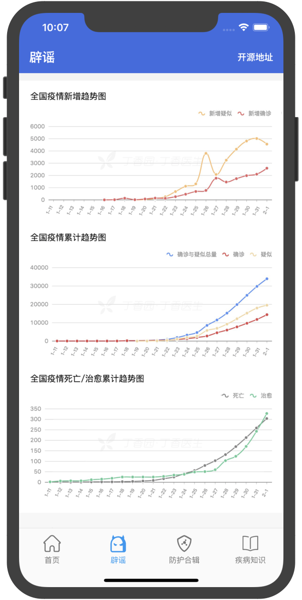
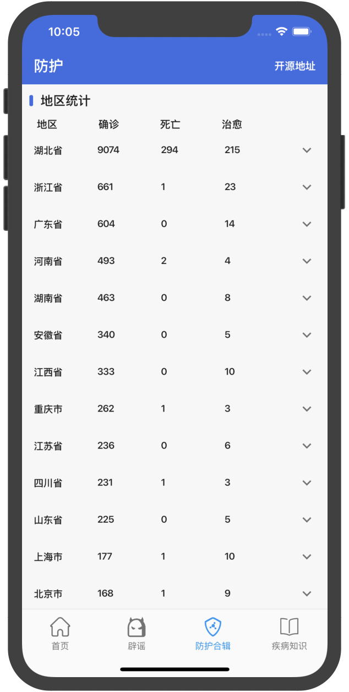
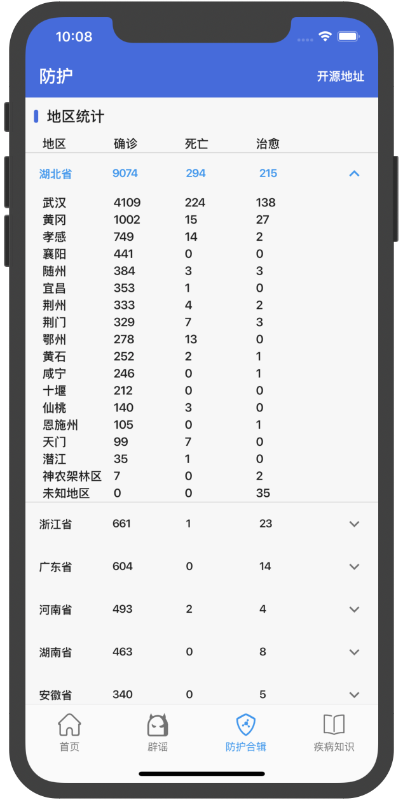

# nCoV_2019

获取新肺炎实时动态App，支持Android和IOS。

# Log
* 2020.2.2
修复了统计的分隔符导致统计数据无法正常显示。

# 项目描述

* [项目起因及描述看这里](https://juejin.im/post/5e2c6a6e51882526b757cf2e)
* [本项目介绍文章](https://juejin.im/post/5e2c8ba3e51d4557e86e9b8c)

# App体验
##### Android 下载地址:
[http://www.flutterj.com/nCoV-2019.apk](http://www.flutterj.com/nCoV-2019.apk)

##### Android（二维码下载）:

IOS:

拉下代码直接跑即可

# App效果图
||  |  |  |
| --- | --- | --- | --- |
||  |  |  |

# 意见反馈
如果大家有好的意见或者有好的设计图的话可以群内找我。

Flutter交流QQ群：[874592746](https://jq.qq.com/?_wv=1027&k=5coTYqE)

Flutter交流微信群：

